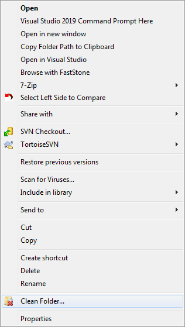
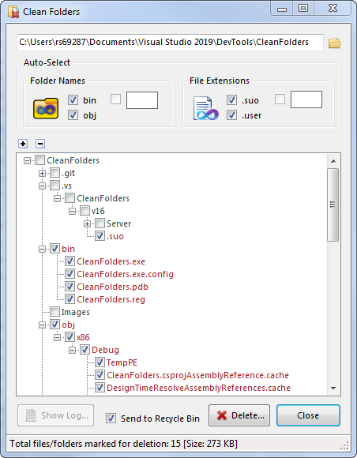
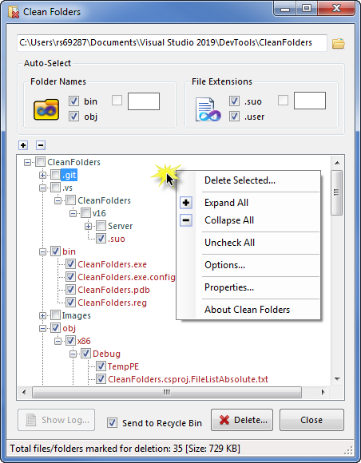
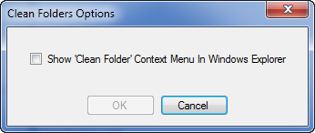
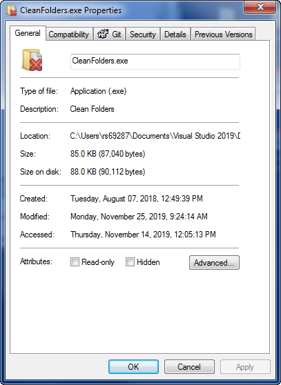
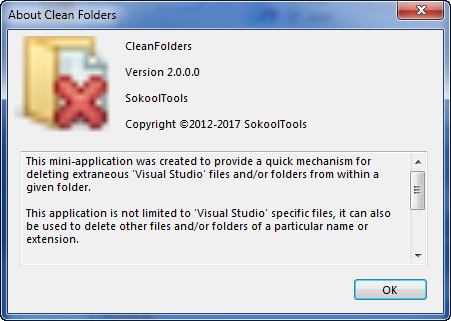
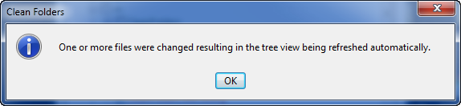

# CleanFolders
Opens an MS Windows mini-application for providing a quick and easy-to-use mechanism for 
deleting extraneous files and/or folders from within a given <b>Visual Studio</b> 
`solution` folder.

This application is not limited to just <b>Visual Studio</b> `solution` specific files 
and folders, i.e., it can also be used to methodically delete other files and folders of a particular 
name or extension.

The following shows the **Clean Folder...** context menu item being displayed when right-clicking 
a folder in Window's Explorer:

Launching this application directly or by selecting **Clean Folder...** context menu opens a 
window such as:

Notice that certain items in the tree view are automatically checkmarked and highlighted in red.
    
These items correspond to the '<b>Folder Names</b>' and '<b>File Extensions</b>' containing checkmarks 
inside the '<b>Auto-Select</b>' group box.

Not so obvious, but there is available a '<i>context menu</i>' when right-clicking anywhere on the main 
listbox as shown here :

From this context menu you can:

    1) Physically delete the currently selected item or items from disk. 
	(Note: A confirmation dialog is displayed prior to the delete actually being performed.)

    2) Expand or collapse all the items displayed in the list at one time.

    3) Uncheck all the items in the list.

    4) Open an 'Options' dialog:

A Window's <i>context menu item</i> is available for quickly launching this application by right-clicking a 
selected folder inside 'MS Windows Explorer'.

The 'Clean Folder Options' dialog is displayed when selecting 'Options...' from the context menu 
defined above:

Place a checkmark beside the "Show 'Clean Folder' context menu..." control; then click the 'OK' button 
to have the <b>Clean Folder...</b> context menu item automatically added to Window's Explorer.

(NOTE: This same context menu item can also be manually added to Window's Explorere by launching the 
"CleanFolders.reg" file included in this solution folder).

    5) Show the 'Properties' window associated with a selected item:

    6) Show the About box dialog:

### Other Notes

A folder can be dragged directly onto this application or opened from within the 
application itself by clicking the 'folder' icon button located adjacent to the folder path.

This application is also aware of any changes being made (outside of the application itself), to all the 
files and folders located in the parent folder and child folders:

